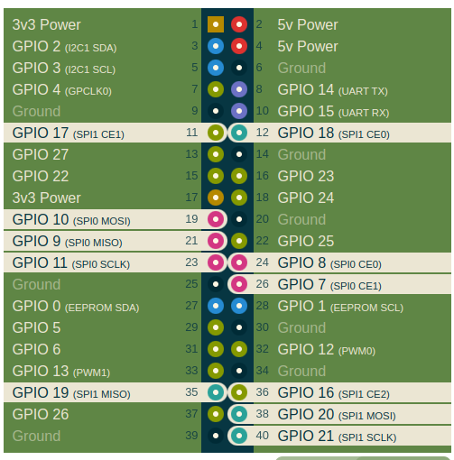

# drone-medium
This is a documention repo on how can you make your Raspberry Pi a medium for debugging and communicating to dronecan nodes through CAN and


# CAN setup 
> via MCP2515


### Raspberry 4

* Signal Connection

  
  

| RP4 HEADR | RP4 GPIO | SIGNAL   | MCP2515 TJA1050 MODULE                                  |
| --------- | -------- | -------- | ------------------------------------------------------- |
| #01       | Power    | 3,3V     | VCC                                                     |
| #02       | Power    | 5V       | Extra wire to TJA1050 VCC                               |
| #06       | Power    | GND      | GND                                                     |
| #09       | Power    | GND      | GND to CAN BUS (there is no GND terminal on CAN MODULE) |
| #19       | GPIO 10  | MOSI     | SI                                                      |
| #21       | GPIO 9   | MISO     | SO                                                      |
| #23       | GPIO 11  | SCLK     | SCK/CLK                                                 |
| #24       | GPIO 8   | SPI0.CE0 | CS                                                      |
| #32       | GPIO 12  | INT      | INT                                                     |


* Inteface Configuration
  
  1. update your packages ```sudo apt update;sudo apt upgrade;```
  2. append the following lines to your configration file  located in ```/boot/config.txt```:
        ```
        [all]
        dtparam=spi=on
        #dtoverlay=mcp2515-can0,oscillator=<Oscillator Frequency in hertz>,interrupt=<GPIO for Interrupt pin>
        # in our case
        dtoverlay=mcp2515-can0,oscillator=16000000,interrupt=12
        ```
  3. install can-utils ```sudo apt install can-utils```
  4. evaluate if the can0 is on your SPI bus ```ls /sys/bus/spi/devices/spi0.0/net/```(it should show 'can0')
  5. set up yor can interface ```sudo ip link set can0 up type can bitrate 1000000```
       > the bitrate for our case is 1000000, you may change it to your preffered bitrate
  6. check if can0 is interface ```sudo ifconfig```
Finally now you can send or receive something overthe bus using ``` candump ``` and  ```cansend```