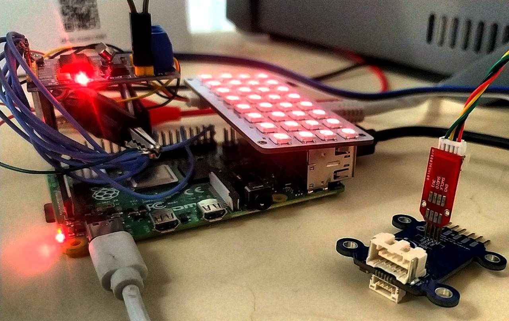

# drone-medium
This is a documention repo on how can you make your Raspberry Pi a medium for debugging and communicating to dronecan nodes through CAN and SWD


## CAN setup 
> via MCP2515


### Raspberry 4

* Signal Connection

  
  

| RP4 HEADR | RP4 GPIO | SIGNAL   | MCP2515 TJA1050 MODULE                                  |
| --------- | -------- | -------- | ------------------------------------------------------- |
| #01       | Power    | 3,3V     | VCC                                                     |
| #02       | Power    | 5V       | Extra wire to TJA1050 VCC                               |
| #06       | Power    | GND      | GND                                                     |
| #09       | Power    | GND      | GND to CAN BUS (there is no GND terminal on CAN MODULE) |
| #19       | GPIO 10  | MOSI     | SI                                                      |
| #21       | GPIO 9   | MISO     | SO                                                      |
| #23       | GPIO 11  | SCLK     | SCK/CLK                                                 |
| #24       | GPIO 8   | SPI0.CE0 | CS                                                      |
| #32       | GPIO 12  | INT      | INT                                                     |


* Inteface Configuration
  
  1. update your packages ```sudo apt update && sudo apt upgrade;```
  2. append the following lines to your configration file  located in ```/boot/config.txt```:
        ```
        [all]
        dtparam=spi=on
        #dtoverlay=mcp2515-can0,oscillator=<oscillator-frequency-in-hertz>,interrupt=<gpio-for-interrupt-pin>
        # in our case
        dtoverlay=mcp2515-can0,oscillator=16000000,interrupt=12
        ```
  3. install can-utils ```sudo apt install can-utils```
  4. evaluate if the can0 is on your SPI bus ```ls /sys/bus/spi/devices/spi0.0/net/```(it should show 'can0')
  5. set up yor can interface ```sudo ip link set can0 up type can bitrate 1000000```
       > the bitrate for our case is 1000000, you may change it to your preffered bitrate
  6. check if can0 is interface ```sudo ifconfig```
        ```
        mbed@ahuratus:~ $ ifconfig
        can0: flags=193<UP,RUNNING,NOARP>  mtu 16
                unspec 00-00-00-00-00-00-00-00-00-00-00-00-00-00-00-00  txqueuelen 10  (UNSPEC)
                RX packets 396  bytes 3168 (3.0 KiB)
                RX errors 0  dropped 0  overruns 0  frame 0
                TX packets 0  bytes 0 (0.0 B)
                TX errors 0  dropped 0 overruns 0  carrier 0  collisions 0

        ```
  7. Finally now you can send or receive something overthe bus using ``` candump ``` and  ```cansend```
        ```
        mbed@ahuratus:~ $ candump can0
        can0  1801555C   [8]  1A 00 00 00 00 02 00 D4
        can0  1801555C   [8]  1B 00 00 00 00 02 00 D5
        can0  1801555C   [8]  1B 00 00 00 00 02 00 D6
        ```

## SWD setup
> via BCM2835 and [Open On-Chip Debugger](http://openocd.org) 


### Raspberry 4

* Signal Connection
  
| RP4 HEADR | RP4 GPIO | SIGNAL |
| --------- | -------- | ------ |
| #17       | Power    | 3,3V   |
| #20       | Power    | GND    |
| #18       | GPIO 24  | SWCLK  |
| #22       | GPIO 25  | SWIO   |


* Build and Install openocd
  
  1. Install building utils ```sudo apt-get install git autoconf libtool make pkg-config libusb-1.0-0 libusb-1.0-0-dev```
  2. Clone openocd repository ```git clone http://openocd.zylin.com/openocd```
  3. ``` cd openocd;chmod +x ./bootstrap; chmod +x ./configure;```
  4. ``` ./bootstrap```
  5. configure bcm2835 ```./configure --enable-sysfsgpio --enable-bcm2835gpio```
  6. ```make```
  7. Install openocd ``` sudo make install ```

* configre swd via openocd on raspberry pi 4 
  1. create an openocd interface in directory ```<openocd_directory>/scripts/interface/raspberrypi4-native.cfg``` using the following command 
  ```
  sudo echo "#
  # Config for using Raspberry Pi's expansion header
  #
  # This is best used with a fast enough buffer but also
  # is suitable for direct connection if the target voltage
  # matches RPi's 3.3V and the cable is short enough.

  adapter driver bcm2835gpio
  bcm2835gpio peripheral_base 0x3F000000

  # Transition delay calculation: SPEED_COEFF/khz - SPEED_OFFSET


  # These depend on system clock, calibrated for stock 700MHz
  # bcm2835gpio speed SPEED_COEFF SPEED_OFFSET
  bcm2835gpio speed_coeffs 146203 36


  # Each of the SWD lines need a gpio number set: swclk swdio
  # swd gpio pins      swclk swio
  adapter gpio swclk 24
  adapter gpio swdio 25

  adapter speed 100
  transport select swd
  " > /usr/local/share/openocd/scripts/interface/raspberrypi4-native.cfg
  ```


  2. Now create your gdb configuration 
      ```
      echo "
      source [find interface/raspberrypi4-native.cfg]
      # for STM32F1xx mcus
      set CHIPNAME stm32f1
      source [find target/stm32f1x.cfg]
      # did not yet manage to make a working setup using srst
      #reset_config srst_only
      reset_config  srst_nogate
      init
      targets
      reset halt
      ">openocd.cfg
      ```
  3. start debugging ```sudo openocd```
      ```
        mbed@ahuratus:~ $ openocd 
        Open On-Chip Debugger 0.12.0-rc2+dev-00019-g9d925776b (2022-11-23-13:01)
        Licensed under GNU GPL v2
        For bug reports, read
        	http://openocd.org/doc/doxygen/bugs.html
        Info : BCM2835 GPIO JTAG/SWD bitbang driver
        Info : clock speed 1001 kHz
        Info : SWD DPIDR 0x1ba01477
        Info : [stm32f1.cpu] Cortex-M3 r1p1 processor detected
        Info : [stm32f1.cpu] target has 6 breakpoints, 4 watchpoints
        Info : starting gdb server for stm32f1.cpu on 3333
        Info : Listening on port 3333 for gdb connections
        [stm32f1.cpu] halted due to debug-request, current mode: Thread 
        xPSR: 0x01000000 pc: 0x080015b8 msp: 0x20005000
        Info : Listening on port 6666 for tcl connections
        Info : Listening on port 4444 for telnet connections

      ```
